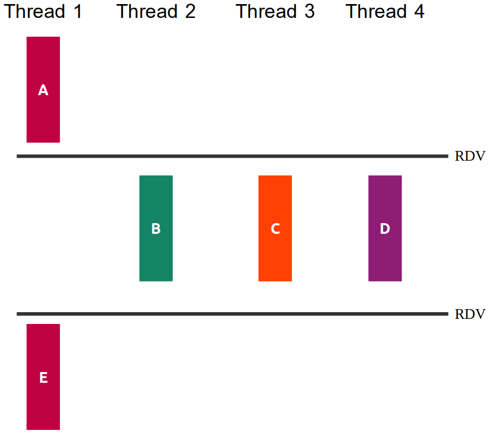

# Prova Final - Sistemas Hardware-Software

Neste prova iremos avaliar os objetivos de aprendizagem trabalhados na segunda metade do curso. Cada pasta contém os arquivos de uma questão da prova, incluindo arquivos `.c` para vocês colocarem suas soluções.

---

## Regras da prova
<style scoped>section { font-size: 20px; }</style>
1. A prova é individual. São permitidas consultas a todos os materiais de aula, incluindo suas soluções a exercícios de aula e labs. 
1. Não é permitido consultar outras pessoas, sejam do Insper ou não, durante a prova.
1. Esta prova também avalia fluência nos conceitos estudados.
1. A prova terá duração de `três horas`, com início às **15:00** e término às **18:00**. Desconsidere o tempo do proctorio.
1. A entrega da sua prova deverá ser feita via Blackboard. **Não serão aceitas entregas por outros meios**.
1. O item de entrega permite múltiplas tentativas. Sempre que terminar uma questão faça uma entrega completa. Isto visa minimizar problemas com entregas atrasadas.
1. Sua entrega consiste na pasta da prova inteira. Rezipe e entregue via Blackboard.
1. A chamada na prova será pela inicialização do proctorio.
1. Cada questão possui um arquivo específico para digitar sua entrega. Não altere o nome destes arquivos.
1. Avisos durante a prova serão feitos via texto no canal *Provas*. Não iniciaremos chamada.
1. Atendimentos durante a prova serão feitos via chat. Vocês podem acionar diretamente o Maciel ou Deusany!

---

## Questão 1 (2,5)
<style scoped>section { font-size: 20px; }</style>

A figura *q1/sincronizacao.png* ilustra as relações de dependência entre as partes das funções `thread1, thread2, thread3` e `thread4`, mostrando que algumas delas poderiam ser feitas de maneira concorrente.



---

## Questão 1 (2,5)
<style scoped>section { font-size: 20px; }</style>

Seu trabalho nesta questão será:

1. criar threads para execução concorrente das funções (40%)
2. usar semáforos para que a ordem dos prints das partes das tarefas respeitem o diagrama da figura (60%)

**OBS**:
- Você não deve introduzir novas dependências. Ou seja, se seu programa criar relações de dependência além das da figura seu trabalho valerá no máximo 50%.
- Não altere os `printf` existentes, nem adicione novos.

---

## Questão 2 (2,5)
<style scoped>section { font-size: 20px; }</style>

Acabaram de lançar uma nova criptomoeda chamada **SisCoin**! Nela, a transferência de valores é feita utilizando um executável `siscoin`, cujo código não está disponível.

Para realizar uma transferência, podemos executar no terminal, por exemplo, o comando:

`./siscoin abc123 def456 25.1`

No exemplo, estamos tentando transferir `25.1` **SisCoins** da carteira origem `abc123` para a carteira de destino `def456`

Se você não é um entusiasta das creptomoedas e bitcóio, pense nas carteiras como contas bancárias de origem e destino!

O comportamento do retorno (`return`) do programa `./siscoin` é:
- Quando o valor de transferência é **negativo** ou a **quantidade de parâmetros está incorreta**, ele retorna **-1**
- Quando uma transferência é **bem sucedida**, ele retorna **0**
- Quando ocorre uma **falha na rede**, ele retorna um valor inteiro de **1** a **4** (inclusive)

---

## Questão 2 (2,5)
<style scoped>section { font-size: 20px; }</style>

Ultimamente a rede da `SisCoin` anda um pouco instável e por muitas vezes as transferências não são realizadas. Se você tentar novamente, pode ser que consiga transferir, mas vamos fazer melhor!

Uma tarefa comum em programação de sistemas é **integrar com outros programas** instalados.

Seu trabalho nesta questão será desenvolver um programa `q2` em *C* (altere o arquivo `q2.c`) que recebe três parâmetros pelo terminal: **carteira de origem**, **carteira de destino** e **valor**.

Você deve realizar um fork e chamar o executável `./siscoin` **repetidamente** até que a transferência consiga ser realizada (até que `siscoin` retorne **0**).


Exemplo de chamada do seu programa no padrão `./q2 <origem> <destino> <valor>`:
`./q2 2uyoh 2hjlkj 19.8`

**Atenção**:
- O executável `siscoin` também tem a chamada no padrão `./siscoin <origem> <destino> <valor>`

---

## Questão 2 (2,5)
<style scoped>section { font-size: 20px; }</style>

**OBS**:
- Trabalhe no arquivo `q2.c` e complete as partes faltantes
- Compile com `gcc q2.c -o q2`
- Deixei um arquivo executável `q2_ref` que exemplifica o comportamento desejado do programa final. Teste, por exemplo, com `./q2_ref abc1 def2 19.5` e utilize como referência!
- O executável `siscoin` não está realizando nenhuma conexão com a rede! É apenas uma simulação!
- O executável `siscoin` tem comportamento aleatório, então as vezes irá demorar mais para conseguir transferir
- Você não precisa se preocupar com os parâmetros das carteiras, pode ser qualquer string! O siscoin valida apenas o 4º parâmetro (valor), além da quantidade de parâmetros

**Nesta questão você deverá usar as funções de gerenciamento de processos e chamada de executáveis vistas em aula. Você não pode usar `system`.**

---

## Questão 3 (2,5)
<style scoped>section { font-size: 20px; }</style>

Abra o arquivo `q3.c`!

Você sabia que o valor de $\pi$ pode ser aproximado por simulação?! No arquivo `q3.c`, a função `aproxima_pi()` busca fazer exatamente isto. Ela sempre guarda o último valor calculado para $\pi$ em uma variável global chamada `pi`.

O problema é que o programa roda em laço infinito! Ele nunca para e nunca produz uma resposta.

Sua tarefa neste exercício é:
- Exibir o PID do processo (**10% da nota**)
- Alterar o programa para que quando o processo receber um sinal **SIGINT** (o mesmo enviado quando o usuário aperta CTRL+C no terminal), dar um printf no valor atual da variável global `pi` e encerrar o processo (**60% da nota**)
- Além do item acima, ao receber **SIGINT**, salvar o valor atual da variável global `pi` em formato de texto em um arquivo `pi.txt` antes de encerrar o processo (**30% da nota**)

---

## Questão 3 (2,5)
<style scoped>section { font-size: 20px; }</style>

**OBS**:
- Você deve criar uma função para ser o handler do **SIGINT**
- O Handler deve ser registrado na main
- Para os arquivos, utilize APENAS as chamadas vistas em aula: open, close, read, write. Não pode utilizar fopen por exemplo


---

## Questão 4 (2,5)
<style scoped>section { font-size: 20px; }</style>

No lab de processos trabalhamos com strings para tratar as URLs a serem lidas e os nomes de arquivos a serem salvos. Iremos fazer algo parecido!

Neste exercício seu trabalho será criar uma função

```c
char *extrai_primeira_hashtag_user (char *tweet_completo)
```

que analisa a string `tweet_completo` e retorna um ponteiro para `char` contendo:
- A primeira hashtag contida no tweet. Ex: **#praia**
**OU**
- A primeira menção de algum usuário. Ex: **@BarackObama**

Abra o arquivo `q4.c`, analise os testes e implemente a função acima. A saída do programa de testes indica a nota obtida ().

Para compilar:

```
gcc -Og -g q4.c -o q4
```

---

## Questão 4 (2,5)
<style scoped>section { font-size: 20px; }</style>

**OBS**:
- A função retorna apenas a primeira hashtag ou usuário, conforme o que estiver primeiro no tweet
- Considere que uma hashtag ou usuário sempre inicia com `@` ou `#`, independente do que vem antes
- Considere que hashtags e nomes de usuários possuem apenas letras de `a..z`, maiúsculas ou miníusculas, mas sem acentuação ou outros símbolos